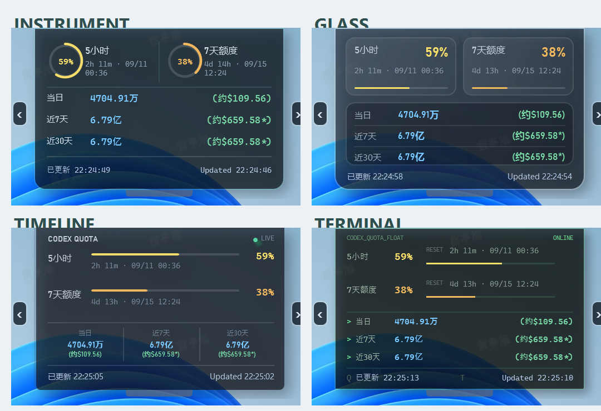

<div align="center">

# UsageLens

### 轻量、常驻顶部的 Codex 额度与 Token 用量悬浮窗

**A lightweight, always-on-top Windows widget for Codex usage monitoring.**

[简体中文](README.md) · [English](README_EN.md)

[](https://github.com/miaotingxu/UsageLens/releases/latest) [](LICENSE) 

[下载最新版](https://github.com/miaotingxu/UsageLens/releases/latest) · [快速开始](#快速开始) · [English](README_EN.md)

实时查看 Codex 额度、重置倒计时、本地 Token 用量和预估成本。<br>
无需额外登录，无需 API Key，数据留在本机。

</div>

## 为什么使用 UsageLens

### 实时掌握额度

查看 5 小时和 7 天额度、剩余百分比、重置倒计时与具体重置时间，并用颜色快速识别当前状态。

### 了解本地用量

聚合当前电脑保存的当日、近 7 天和近 30 天 Token，用实际记录的模型估算输入与输出成本。

### 安静地常驻顶部

窗口固定在主屏幕顶部，只能水平拖动；鼠标离开后自动折叠，保留 80×8 像素把手。四套 UI 共用同一套数据和交互逻辑。

## 界面预览

当前版本内置四套界面，可通过窗口两侧箭头循环切换：Instrument、Glass、Timeline 和 Terminal。它们共享额度、Token、刷新、倒计时和折叠逻辑，只改变视觉呈现。



## 下载与安装

从 [Releases](https://github.com/miaotingxu/UsageLens/releases/latest) 下载 `UsageLens-v{版本号}-win-x64-portable.zip`。

这是 Windows x64 免安装便携版：解压后直接运行 `UsageLens.exe`，不需要另外安装 .NET Runtime。

> 使用前仍需在本机安装并登录 Codex。UsageLens 复用 Codex 的现有登录状态读取额度。

## 系统要求

| 项目 | 要求 |
| --- | --- |
| 操作系统 | Windows 10 或 Windows 11，x64 |
| Codex | 已安装且已登录 |
| 网络 | 获取最新额度时需要可用网络 |
| .NET Runtime | 便携版不需要 |

## 快速开始

1. 从最新 Release 下载 Portable ZIP。
2. 将 ZIP 完整解压到任意目录，不要直接在压缩包内运行。
3. 双击 `UsageLens.exe`。

## 操作方式

| 操作 | 效果 |
| --- | --- |
| 按住左键水平移动 | 沿主屏幕顶部左右拖动 |
| 点击左侧或右侧箭头 | 循环切换四套 UI |
| 鼠标离开窗口 1 秒 | 向顶部自动折叠 |
| 鼠标移入顶部把手 | 立即展开 |
| 右键 → 刷新 | 同时刷新额度和 Token 用量 |
| 右键 → 退出 | 关闭程序 |

样式和水平位置保存在 `%LOCALAPPDATA%\UsageLens\appearance.json`，只包含样式名称和窗口横坐标，不包含账号、额度或会话数据。
首次启动新版时，如果新目录尚无有效配置，程序会从旧版 `%LOCALAPPDATA%\CodexQuotaFloat\appearance.json` 迁移样式和横坐标；旧目录不会删除。

## 数据来源与隐私

额度通过本机 `codex app-server` 复用 Codex 登录状态读取，启动时读取一次，之后每 60 秒刷新。Token 只扫描当前电脑 `%USERPROFILE%\.codex\sessions` 最近 30 个自然日的会话元数据，每 5 分钟刷新；不会读取、保存或上传对话正文。

统计不包含其他电脑、已删除记录或未落盘会话。程序不读取或保存 `auth.json`、API Key 或密码。

剩余比例颜色规则：81–100% 绿色、50–80% 黄色、20–49% 琥珀色、0–19% 红色；无数据为中性灰。

## Token 价格估算

价格按本地会话记录中的模型和输入/输出 Token 估算，单位为每 100 万 Token：

| 模型 | 输入 | 输出 |
| --- | ---: | ---: |
| GPT-5.6 Sol | $4.00 | $20.00 |
| GPT-5.6 Terra | $2.00 | $12.00 |
| GPT-5.6 Luna | $0.20 | $1.20 |
| GPT-6 Astra | $8.00 | $40.00 |
| codex-auto-review | $2.00 | $12.00 |

未覆盖模型的 Token 不计入估价；价格后的 `*` 表示存在未计价 Token。价格仅供参考，不代表任何服务商的真实账单、套餐价值或额度扣减金额。

## 常见问题

### 双击后看不到窗口

检查屏幕最上方是否只保留了折叠把手，将鼠标移到把手上即可展开。也可以结束已有的 `UsageLens.exe` 后重新启动。删除 `%LOCALAPPDATA%\UsageLens\appearance.json` 可重置样式和位置。

### 额度显示 `--`

确认 Codex 已安装、已经登录且网络可用。临时失败时程序会保留最近一次成功结果并尝试重新连接。

### Token 显示为 0

这表示本机最近 30 个自然日内没有可统计的 Codex 会话记录，并不表示读取失败。

## 从源码构建

需要 [.NET 10 SDK](https://dotnet.microsoft.com/download/dotnet/10.0)。

```powershell
git clone https://github.com/miaotingxu/UsageLens.git
cd UsageLens
dotnet build .\UsageLens.csproj -c Release
dotnet run --project .\UsageLens.csproj
```

运行测试：

```powershell
dotnet run --project .\tests\UsageLens.TokenUsageTests\UsageLens.TokenUsageTests.csproj -c Release
dotnet run --project .\tests\UsageLens.PresentationTests\UsageLens.PresentationTests.csproj -c Release
```

生成便携包：

```powershell
.\scripts\package-release.ps1 -Version 1.3.1
```

## 路线图

- 改善多显示器体验。
- 提供可配置的刷新与折叠行为。
- 扩展可识别模型和价格规则。
- 改善发布包签名和更新体验。

## 参与贡献与 License

请阅读 [CONTRIBUTING.md](CONTRIBUTING.md)。安全问题请按照 [SECURITY.md](SECURITY.md) 私下报告。本项目采用 [MIT License](LICENSE)。
